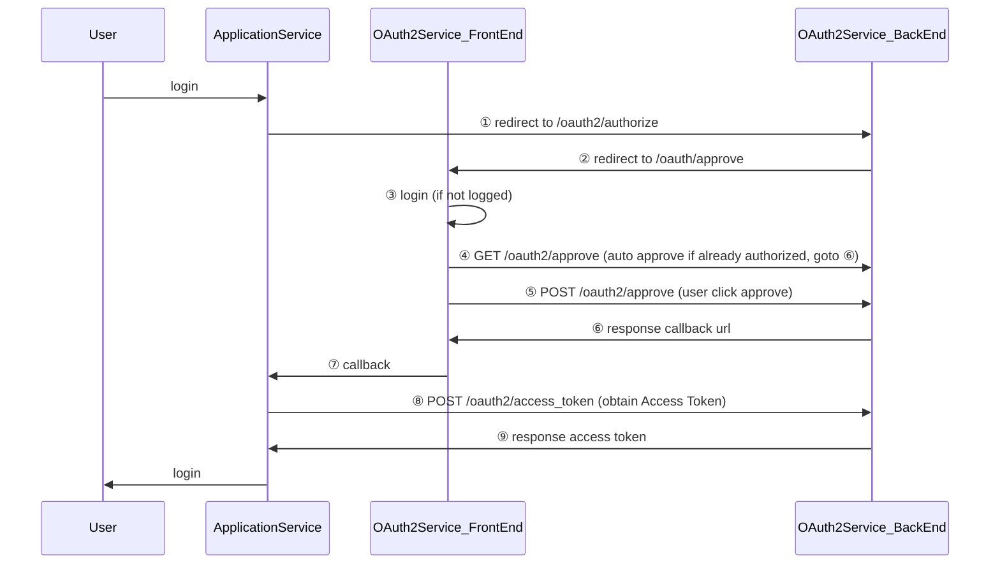

# Gemini-OAuth2

双子-身份验证中心

* Gemini-OAuth2-Api
  * gemini-oauth2-parent
  * Galaxy-Microservices
  * gemini-oauth2-api
* Gemini-OAuth2-Web

## OAuth2流程图

## API

### 请求用户身份认证

GET /oauth2/authorize

**请求字段：**

| 字段          |  类型  | 描述                                |
| :------------ | :----: | :---------------------------------- |
| response_type | string | 固定值`code`                        |
| client_id     | string | 在后台注册时，拿到的`ApplicationID` |
| redirect_uri  | string | 可选，重定向地址                    |
| scope         | string | 可选，请求的权限列表                |
| state         | string | 随机字符串，每次请求必须不同        |

**响应字段：**

| 字段  |  类型  | 描述                                   |
| :---- | :----: | :------------------------------------- |
| code  | string | 凭据，客户端凭此换取AccessToken        |
| state | string | 随机字符串，客户端应校验与请求字段相同 |

### 换取AccessToken

POST /oauth2/access_token

**请求字段：**

| 字段         |  类型  | 描述                                    |
| :----------- | :----: | :-------------------------------------- |
| grantType    | string | 固定值`authorization_code`              |
| code         | string | 调用authorize接口时返回的code字段       |
| redirectUri  | string | 可选，重定向地址                        |
| clientId     | string | 在后台注册时，拿到的`ApplicationID`     |
| clientSecret | string | 在后台注册时，拿到的`ApplicationSecret` |

**响应字段：**

| 字段         |  类型   | 描述           |
| :----------- | :-----: | :------------- |
| accessToken  | string  | AccessToken    |
| tokenType    | string  | 固定值`bearer` |
| expiresIn    | integer | 过期时间       |
| refreshToken | string  | 刷新Token      |
| scope        | string  | 用户授权的范围 |
